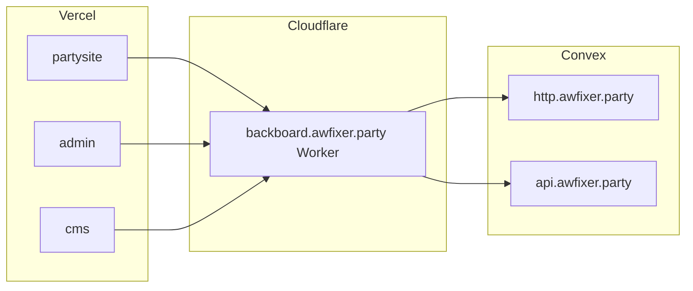

# Awfixer Party monorepo

This repository holds the applications and shared code for **Awfixer Party** web and mobile surfaces. Work is organized around a **headless** architecture: public sites and admin tools talk to a single **Backboard** (Cloudflare Worker) that sits in front of **Convex**, which is the **source of truth** for data, queues, and server-side logic.

**Living documents**

| File | Purpose |
|------|--------|
| [`ROADMAP/WORK.md`](./ROADMAP/WORK.md) | Architecture decisions, Q&A, and constraints (source of truth for “why”). |
| [`ROADMAP/ROADMAP.md`](./ROADMAP/ROADMAP.md) | Phased engineering plan with checklists and subphases. |
| [`docs/ARCHITECTURE.md`](./docs/ARCHITECTURE.md) | Monorepo inventory, import boundaries, workspaces, and CI build hints. |
| [`TODO.md`](./TODO.md) | Traceability list for [Section I](ROADMAP/ROADMAP-SI.md) hygiene tasks (update as subphases close). |

---

## What we are building

- **Partysite** (`partysite/`) — Public **Next.js** site on Vercel, managed from admin. Reads **published** content only; writes go through admin/CMS via Backboard ([`WORK.md`](./ROADMAP/WORK.md) Q10).
- **Admin** (`admin/`) — **Next.js** app at **admin.awfixer.party**: operations, in-house **analytics/observability** UI under `/analytics/**`, forms management, email template management, content orchestration. Stripped out of partysite and hosted as its own app.
- **CMS** (`cms/`) — **Next.js** at **cms.awfixer.party** for editorial workflows: Tiptap-based editor, content types (blog, articles, policies, extensible types). Headless; no deep-linking requirement to other apps ([`WORK.md`](./ROADMAP/WORK.md)).
- **Backboard** — Not a single directory only: **Convex** deployment rooted in `backboard/` **plus** a **Cloudflare Worker** at **backboard.awfixer.party** that proxies and secures ingress. Convex production domains: **http.awfixer.party** (HTTP actions) and **api.awfixer.party** (Convex API).
- **Auth** (`auth/`) — **Stack Auth** maintained as an **in-repo fork** for flexibility (subscriptions, customization). **Clerk is removed**; there is **no legacy user migration** ([`WORK.md`](./ROADMAP/WORK.md)). Public auth entry is **`auth.awfixer.party`**; auth APIs are meant to sit **behind Backboard**.
- **Mobile** (`mobile/`, `admin-mobile/`) — Same Backboard contracts as web; **versioned API headers** and different response shaping per client ([`WORK.md`](./ROADMAP/WORK.md) Q15, Q35).

---

## Architecture at a glance



- **Next.js** runs on **Vercel** (UI, RSC/SSR for pages). **New server APIs** are intended to live on the **Worker** (single ingress); avoid Vercel Route Handlers for new features unless an approved exception applies ([`WORK.md`](./ROADMAP/WORK.md) Q17–18).
- **Secrets:** sensitive keys live in **Worker, 1Password, Convex**, and related infra — **not** in Vercel server env beyond explicitly allowed non-secret configuration ([`WORK.md`](./ROADMAP/WORK.md) Round 3 Q36).
- Visiting **backboard.awfixer.party** directly should **redirect** to **https://awfixer.party** ([`WORK.md`](./ROADMAP/WORK.md) Q17).

### Domain map

| Host | Role |
|------|------|
| **awfixer.party** | Public site (partysite on Vercel) |
| **admin.awfixer.party** | Admin app |
| **cms.awfixer.party** | Editorial CMS |
| **backboard.awfixer.party** | Cloudflare Worker (ingress to Convex) |
| **auth.awfixer.party** | Stack Auth entry |
| **http.awfixer.party** | Convex HTTP actions (production) |
| **api.awfixer.party** | Convex API (production) |

---

## Features (high level)

| Area | Direction |
|------|-----------|
| **Auth** | Stack Auth (IDP); Convex validates tokens for privileged work; authorization **only in Convex** ([`WORK.md`](./ROADMAP/WORK.md) Q24). |
| **Content** | Versioned **Tiptap JSON** in Convex; sanitize client → Worker → Convex ([`WORK.md`](./ROADMAP/WORK.md) Q28–29). |
| **Forms** | Convex storage; **Turnstile**; uploads scanned before durable storage ([`WORK.md`](./ROADMAP/WORK.md) Q11, Q32, Round 3 Q39). |
| **Email** | **Resend** from **awfixer.party**; templates in Convex, edited in admin; **HTML assembled in Convex**, sent by **Worker** ([`WORK.md`](./ROADMAP/WORK.md) Q12, Q30–31). |
| **Billing** | Stripe via Stack-integrated path; **Connect removed/deleted**; webhooks **Convex + Worker**, queue in Convex, idempotent ([`WORK.md`](./ROADMAP/WORK.md) Q25–26, Q37). |
| **Analytics** | Rich **non-PII** behavioral metrics where policy allows; **7-year** retention with **cold/archive** storage emphasis ([`WORK.md`](./ROADMAP/WORK.md) Q14, Q33, Round 3 Q40). |
| **Audit** | **Tamper-evident append-only** audit store with export ([`WORK.md`](./ROADMAP/WORK.md) Round 3 Q38). |
| **Security** | WAF/rate limits; ingress routing with **rotating keys** (KV + rotation); **maximal** threat posture ([`WORK.md`](./ROADMAP/WORK.md) Q5, Q21–22). |

---

## Repository layout (top level)

Workspaces: the root [`package.json`](./package.json) is a **Bun** workspace over `partysite`, `admin`, `cms`, `backboard`, `mobile`, and `admin-mobile`. The **`auth/`** subtree is a separate **pnpm** monorepo (Stack Auth fork)—install and build it only inside `auth/`. Details: [`docs/ARCHITECTURE.md`](./docs/ARCHITECTURE.md).

```
awfixerparty/
├── README.md          # This file
├── TODO.md            # Section I traceability / next hygiene tasks
├── docs/
│   └── ARCHITECTURE.md
├── ROADMAP/
│   ├── WORK.md        # Decisions and Q&A
│   ├── ROADMAP.md     # Phased plan
│   └── …              # Section roadmaps (e.g. ROADMAP-SI.md)
├── admin/             # admin.awfixer.party
├── cms/               # cms.awfixer.party
├── partysite/         # Public site
├── backboard/         # Convex project + backboard-related code
├── auth/              # In-repo Stack Auth fork
├── mobile/
├── admin-mobile/
└── …
```

Individual apps may have their own README (for example `admin/README.md`, `cms/README.md`).

---

## Development

From the repo root, run **`bun install`** once, then either `cd <app>` and use that app’s scripts or use root helpers such as **`bun run build:admin`** (see root `package.json` `scripts`). For **`auth/`**, use **`pnpm`** inside that directory only. Convex/Cloudflare CLIs follow **backboard** and deployment docs when they exist.

For **what to do next**, follow [`ROADMAP/ROADMAP.md`](./ROADMAP/ROADMAP.md), track Section I follow-ups in [`TODO.md`](./TODO.md), and keep **`ROADMAP/WORK.md`** updated when decisions change.

---

## Contributing and tracking work

- Prefer **small PRs** per section of the roadmap.
- Each roadmap **subphase** ends with: **update [`TODO.md`](./TODO.md)** (or your external tracker) so the next chunk of work is visible without reading every markdown file.
- Questions that still need product/engineering workshop are called out in [`ROADMAP/WORK.md`](./ROADMAP/WORK.md) (e.g. **admin ↔ partysite concrete operations**, Q8).

---

_Legal/compliance copy (FEC, retention, PII boundaries) must be reviewed by counsel; [`ROADMAP/WORK.md`](./ROADMAP/WORK.md) captures intent only._
