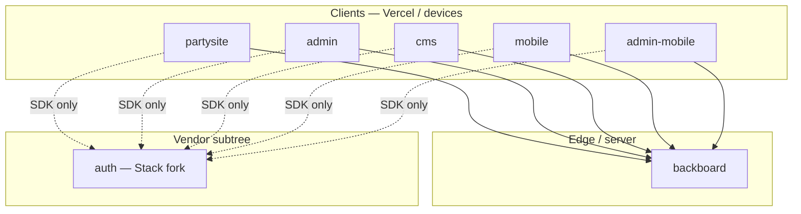

# Monorepo layout and package boundaries

This document inventories **top-level applications**, **dependency rules** (who may import whom), and how **workspaces / CI** should treat each surface. It complements [`ROADMAP/WORK.md`](../ROADMAP/WORK.md) (architecture Q&A) and the root [`README.md`](../README.md).

---

## 1. Top-level inventory

| Directory | Role | Package manager | Notes |
|-----------|------|-----------------|--------|
| `partysite/` | Public Next.js site (Vercel) | **Bun** (`packageManager` in package) | Primary web surface; Convex client + Backboard ingress. |
| `admin/` | Admin Next.js app | **Bun** (no `packageManager` field yet; use Bun 1.3.11 to match repo) | Operations, analytics UI, orchestration. |
| `cms/` | Editorial CMS (Next.js) | **Bun** | Headless content; Tiptap-focused. |
| `backboard/` | Convex-adjacent **Nitro** server (`nitro build`) | **Bun** | Name in `package.json`: `backboard` (ingress / HTTP layer alongside Convex; see `WORK.md`). |
| `mobile/` | Expo (public) | **Bun** | Same Backboard contracts as web; versioned API headers. |
| `admin-mobile/` | Expo (admin) | **Bun** | Same constraints as `mobile/`. |
| `auth/` | In-repo **Stack Auth** fork | **pnpm** + Turbo (nested monorepo) | **Not** a member of the root Bun workspace. Build with `pnpm` inside `auth/` only. |

Party **Convex** function sources live under **`backboard/convex/`** (same installable package as the Nitro server). Next.js apps depend on the `convex` client and deployment URLs per their own env and codegen; do not import `backboard/convex/*.ts` from Vercel app source trees.

---

## 2. Dependency rules (import boundaries)

Rules are **policy** until enforced by ESLint / dependency-cruiser (see [`TODO.md`](../TODO.md) I.A.2 closure).

### 2.1 Allowed direction

- **`partysite`, `admin`, `cms`, `mobile`, `admin-mobile`** may call **HTTP APIs** exposed via **Backboard** (and Convex public surfaces per `WORK.md`). They must **not** import implementation files from `backboard/` or from each other’s `app/` / `components/` trees.
- **`backboard`** may depend on Convex, HTTP clients, and shared **npm** libraries. It must **not** import Next.js app directories from `partysite`, `admin`, or `cms`.
- **`auth/`** is isolated: Party apps consume **published-style** Stack packages or env-configured endpoints; they do **not** import deep paths from `auth/apps/*` or `auth/packages/*`.
- **No imports** from `mobile` → `partysite` (or reverse) except via future **intentional shared packages** (e.g. `packages/*`) once those exist.

### 2.2 Shared code (future)

When `packages/*` is introduced: **only** thin types, API clients, and design tokens should live there; **no** app-specific routes or server-only secrets. Dependency rules will be updated to list each package explicitly.

---

## 3. Workspace configuration

- **Root** [`package.json`](../package.json) declares a **Bun workspace** over: `partysite`, `admin`, `cms`, `backboard`, `mobile`, `admin-mobile`.
- **`auth/`** stays **outside** that workspace (pnpm, `auth/pnpm-workspace.yaml`, Turbo). Clone/install/build it as its own tree when working on the fork.
- Install once at repo root: `bun install`. Run a single workspace with Bun’s `--filter` using each package’s `name` field (e.g. `partysite`, `admin`).

---

## 4. CI: building each surface independently

Typical matrix (adjust for secrets and Convex deploy policy):

| Package | Working directory | Example command |
|---------|-------------------|-----------------|
| partysite | repo root | `bun --filter partysite run build` |
| admin | repo root | `bun --filter admin run build` |
| cms | repo root | `bun --filter cms run build` |
| backboard | repo root | `bun --filter backboard run build` |
| mobile | repo root | `bun --filter mobile run <script>` (see app `package.json`; EAS/export as needed) |
| admin-mobile | repo root | `bun --filter admin-mobile run <script>` |
| auth | `auth/` | `pnpm install` then `pnpm run build` (or targeted Turbo filter) |

**Note:** `partysite` defines `prebuild` with Convex codegen/deploy; CI jobs may need env vars, or a dedicated `build:vercel`-style script without deploy, depending on pipeline design.

Root **npm scripts** (if present) proxy to `--filter` for discoverability.

---

_Last updated for ROADMAP Section I.A.2._
